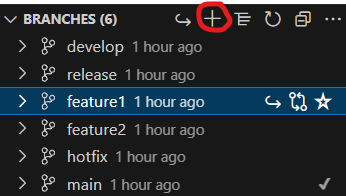
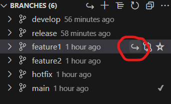
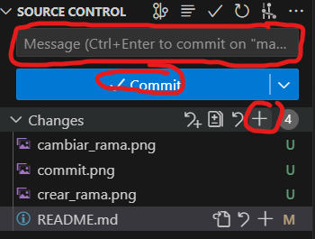
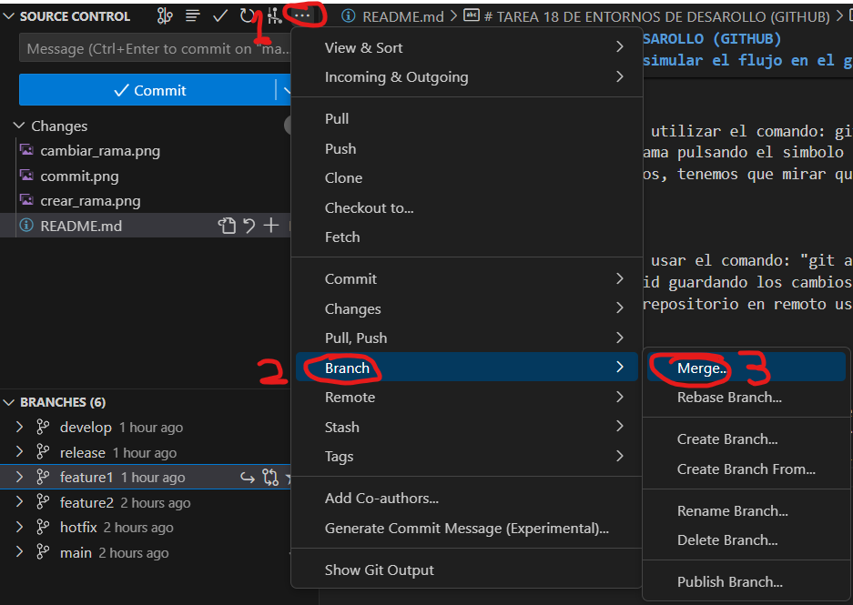
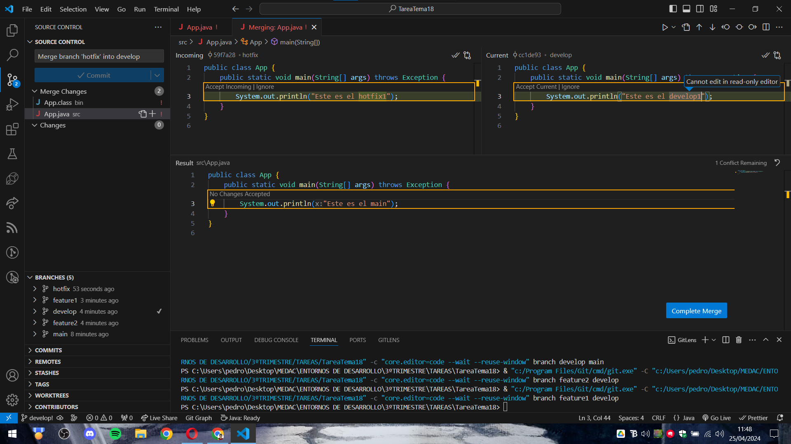
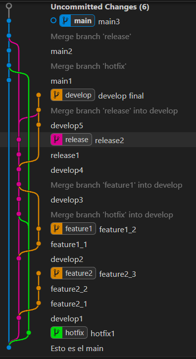

# TAREA 18 DE ENTORNOS DE DESAROLLO (GITHUB)
## ACCIONES REALIZADAS PARA SIMULAR EL FLUJO DE LA FOTO
Primero de todo debemos tener creado un proyecto o cualquier otro archivo el cual vayamos a ir modificando con el tiempo,
sino no tendría sentido el usar GitHub.

Podemos inicializar el repositorio en local y subirlo cuando queremos o podemos subirlo directamente al repositorio
y trabajar con el en remoto

Tambien debemos de tener instalado alguna que otra extensión para su correcto funcionamiento y para visualizarlo mejor.
Estas son: GitLens para poder realizar las acciones sin la necesidad de usar comandos, sino con una interfaz gráfica, lo cual lo hace más rápido e intuitivo y GitGraph para visualizar las ramas 

### CREAR RAMA
Para crear una rama podemos utilizar el comando: git checkout -b seguido del nombre de la nueva rama que quieres crear.
También podemos crear la rama desde aquí, pulsando el simbolo "+".

### CAMBIAR DE RAMA
Para cambiar de rama podemos utilizar el comando: git checkout seguido del nombre de la rama a la que quieres cambiar.
También podemos cambiar de rama pulsando el simbolo "↪".
Para saber en que rama estamos, tenemos que mirar que rama tiene un tic "✓"

### COMMIT
Para hacer un commit podemos usar el comando: "git add" y "git commit -m mensaje_de_confirmación"
También podemos hacer un comid guardando los cambios pulsando el mas "+" y pulsando en la opción commit para finalizar. Hecho los commits podremos subirlo al repositorio en remoto usando el comando: "git push origin nombre_de_la_rama" o hacerlo al final dandole a "publish branch".

### MERGE
Para hacer un merge podemos usar el comando: "git merge nombre_de_rama"
Tambien podemos usar la funcion merge desde la interfaz, para ello nos debemos situar en la rama donde quieres que se haga el merge(fusión) y cuando pulsemos en merge deberemos de seleccionar la rama con la que queremos fusionarla.

## CONFLICTO ENTRE RAMAS
Puede pasar que cuando hagamos un merge o fusión de dos ramas ocurra un conflicto entre ambos, esto puede ocurrir porque el VsCode no sabe que codigo coger de los dos, entonces nos abrira una ventana donde nos dara a elegir dos caminos o podemos poner nosotros como queremos que se quede.

Este es un ejemplo de lo que ocurre cuando entran dos ramas en conflicto al fusionarse:

## RESULTADO FINAL
El unico fallo que he tenido en la simulacion del git de la foto es que el ultimo merge que se hace en el main lo hace con develop y no con release.

Otro dato a tener en cuenta es que en las ramas se repite el color naranja: Feature1, Feature2 y release

